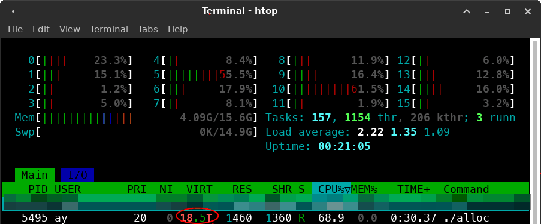

# Sanal Bellek Deneyleri (BİTMEDİ)

```{todo}
Yazı henüz tamamlanmamıştır.
```

Bu yazıda [bir önceki yazıda](sanal-bellek.md) bahsettiğim sanal bellek kavramı
ile ilgili Linux üzerinde C dilini kullanarak çeşitli denemeler yapacağız. Bu
yazıda biraz Linux'un bellek yönetiminin nasıl çalıştığına bakmaya çalışacağız.
Birazdan göreceğimiz C kodlarının büyük bir kısmını ChatGPT yardımıyla
oluşturdum. O yüzden kodların "kalitesi" en iyisi olmayabilir ama amacımız
burada sanal belleğin nasıl çalıştığını anlamak olduğu için enerjimizi bu konuya
odaklayalım istedim. Hadi başlayalım!

## Sürekli `malloc()`

Aşağıdaki kodu ele alalım:

```c
#include <stdio.h>
#include <stdlib.h>
#include <stdint.h>

#define STEP_SIZE (4 * 1024 * 1024) // 4 MB
#define BYTES_IN_GB (1024 * 1024 * 1024) // Bytes in 1 GB

int main() {
    void *ptr = NULL;   // Pointer to the allocated memory
    size_t total_size = 0; // Total allocated size in bytes
    int iteration = 0;

    while (1) {
        total_size += STEP_SIZE;
        void *new_ptr = realloc(ptr, total_size); // Attempt to resize memory

        if (new_ptr == NULL) {
            printf("Memory allocation failed at %.2f GB (iteration %d).\n",
                   (double)total_size / BYTES_IN_GB, iteration);
            free(ptr); // Free previously allocated memory
            break;
        }

        ptr = new_ptr; // Update pointer to the newly resized memory
        printf("Allocated %.2f GB successfully (iteration %d).\n",
               (double)total_size / BYTES_IN_GB, iteration);

        iteration++;
    }

    return 0;
}
```

Burada `realloc()` fonksiyonu ile C kütüphanesi ve günün sonunda işletim sistemi
sayesinde heap alanımızı sürekli arttırıyoruz. Burada mekanizmanın çalışma
detaylarına girmeyeceğiz. Her `realloc()` çağrısı işletim sistemine
gitmeyecektir. Ama bu deney için yeterli. Döngünün ilk turunda `realloc()`
fonksiyonunun `NULL` pointer ile çağırılmasının `malloc()` fonksiyonu ile
eşdeğer olduğunu hatırlayalım. [^1f]

Kodu derleyelim ve çalıştıralım:

```shell
$ gcc alloc.c -o alloc
```

Bu programı çalıştırdığımızda biraz beklenmedik bir davranış görüyoruz.
Sistemde 16 GB RAM + 16 GB Swap alanı bulunuyor. Programı çalıştırdığımda ise
`realloc()`un hata almadığını **TB boyutunda bellek alabildiğini** görüyorum.
Örnek bir çıktı:

```text
Allocated 24188.36 GB successfully (iteration 6192219).
Allocated 24188.36 GB successfully (iteration 6192220).
Allocated 24188.37 GB successfully (iteration 6192221).
```

Yaklaşık 1 dakika içerisinde 24 TB bellek alabildik gibi duruyor.
Bu nereye kadar devam edecek diye bekledim ve bilgisayarın bellek tüketimi takip
ettim. `top` veya `htop` uygulaması ile baktığım zaman toplam bellek ve swap
alanında bir artış gözlemlemedim. `htop` ta ilgili prosesin `VIRT` bellek alanı
gittikçe artıyordu.



32000 GB, muhtemelen `32768 GB` alanı geçince programın hızının düştüğünü, daha
doğrusu `realloc()` un yavaşladığını gördüm. Bunun sebebini bilmiyorum.
Linux'tan veya libc'den kaynaklanıyor olabilir. 🤔 Hız çok yavaşladığı için
`CTRL-C` ile deneyi durdurdum fakat bıraksam devam edecekti. Önceki yazıda da
bahsettiğim gibi 64-bit Linux sistemlerde prosesler 128 TB sanal bellek
alabiliyorlar. [^2f], [^3f]

İşlem sırasında da `/proc/meminfo` da şöyle bir gözlem yaptım:

```shell
$ cat /proc/meminfo

...
Committed_AS:   34382363712 kB
...
```

**Peki ben toplam belleğin üstünde nasıl alan alabiliyorum?**

## Overcommit Kavramı

BURADAYIM

---

- `ulimit` vs bahset.

[^1f]: <https://man7.org/linux/man-pages/man3/free.3.html>
[^2f]: <https://stackoverflow.com/a/29233537>
[^3f]: <https://access.redhat.com/articles/rhel-limits>
