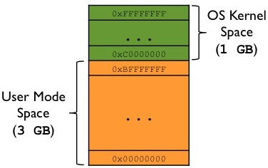

# Sanal Bellek, Virtual Memory

`35-1.27.40`

**Sanal bellek (virtual memory)** bir programın tamamının değil belli kısmının
belleğe yüklenerek disk ile RAM arasında yer değiştirmeli bir biçimde
çalıştırılmasına yönelik bir mekanizmadır. Bu mekanizma sayesinde örneğin 100
MB'lık bir programın başlangıçta yalnızca 64K'lık kısmı RAM'e yüklenebilir.
Sonra program çalışmaya başlar. Çalışma sırasında programın bellekte olmayan bir
kısmına erişildiğinde işletim sistemi programın bellekte olmayan kısmını o anda
diskten belleğe yükler ve çalışma kesintisiz devam ettirilir. Ayrıca gündelik
hayatta *sanal adres* mekanizması da *sanal bellek* olarak adlandırılabilmektedir.
Bu paragrafta aslında biraz da ileride konuşacağımız *swap* mekanizması ağırlıklı
bir açıklama yaptık.

Şu aşamada detay olabilir belki ama Linux'ta **Working Set** denilen bir kavram
vardır. Bir prosesin kaç sayfasının gerçekten fiziksel bellekte olduğunu
gösteren bir kavramdır. [^1f] Bildiğim kadarıyla kernelde bir proses
başlatıldığında kaç adet sayfanın fiziksel belleğe yüklenebileceğini
belirleyebiliyoruz (initial working set size ?). Bu kavramlar yine ağırlıklı
*swap* ve *page fault* gibi terimlerle alakalı.

## Swap In/Out

`35-1.40.40`

Sanal bellek kullanımında yine fiziksel RAM sayfalara ayrılır. Her sayfaya bir
numara verilir. İşletim sistemi RAM'in hangi sayfasının hangi programın neresini
tuttuğunu bir biçimde oluşturduğu veri yapılarıyla bilir duruma gelir. Bir
programın RAM'de olmayan bir sayfasının diskten RAM'e yüklenmesine **swap in**
denilmektedir. Ancak zamanla RAM'deki tüm fiziksel sayfalar dolu duruma
gelebilir. Bu durumda işletim sistemi bir programın bir parçasını RAM'e
çekebilmek için RAM'deki bir sayfayı da RAM'dan atmak durumunda kalır. Bu işleme
ise **swap out** denilmektedir. Tabii işletim sistemi hangi programın RAM'deki
hangi sayfasının boşaltılacağı konusunda iyi bir karar vermek durumundadır.
İşletim sistemine göre *gelecekte kullanılma olasılığı en düşük olan sayfanın*
RAM'den atılması en iyi stratejidir.

Bu durumda bir program çalışırken aslında sürekli bir biçimde disk ile RAM
arasında yer değiştirmeler yapılmaktadır. Bu yer değiştirmelere genel olarak
işletim sistemi dünyasında **swap** işlemi denilmektedir. Şüphesiz swap işlemi
yavaş bir işlemdir ve toplam performans üzerinde en önemli zayıflatıcı
etkilerden birini oluşturmaktadır. Swap işlemlerinin olumsuz etkisini azaltmak
için ilk akla gelen şey fiziksel RAM'i büyütmektir. Ancak fiziksel RAM'in
büyütülmesi maliyet oluşturmaktadır. Bugünkü SSD'ler hard disklere göre oldukça
iyi performans göstermektedir. Dolayısıyla bilgisayarımızda hard disk yerine SSD
varsa swap işlemleri daha hızlı yürütülecektir. Şüphesiz en önemli unsur aslında
sayfaların yer değiştirilmesi konusunda uygulanan algoritmalardır. Bunlara
**page replacement** algoritmaları denilmektedir. Tabii bugünkü işletim
sistemleri bilinen en iyi algoritmaları zaten kullanmaktadır.

`35-1.51.30`

**Pekiyi işletim sistemi programın RAM'de olmayan bir sayfasını yüklemek
istediğinde RAM'den sayfa boşaltacağı zaman boşaltılacak sayfa üzerinde daha
önce yazma işlemleri (update) yapıldıysa ne olacaktır?** İçeriği değiştirilmiş
olan sayfanın RAM'den atılırken mecburen diskte saklanması gerekir. İşte işletim
sistemleri bu işlemler için diskte ismine **swap file** ya da **page file**
denilen dosyalar tutmaktadır. Değiştirilmiş olan sayfaları bu dosyalara
yazmaktadır. Linux işletim sistemi swap alanı olarak genellikle ayrı bir disk
bölümünü kullanmaktadır. Ancak herhangi bir dosya da swap dosyası olarak
kullanılabilmektedir. Kullanılacak swap disk alanının ya da dosyalarının toplamı
bazen önemli olabilir. Çünkü sistemin toplam sanal bellek kapasitesi bu swap
dosyalarıyla da ilgilidir. Linux sistemlerinde o andaki toplam swap alanları
`/proc/swaps` dosyasından elde edilebilir. Ya da `swapon -s` komutuyla aynı
bilgi elde edilebilir. Örnek:

```shell
ay@2204:~$ cat /proc/swaps
Filename                Type        Size        Used    Priority
/swapfile                               file        2097148     0   -2

ay@2204:~$ swapon -s
Filename                Type        Size        Used        Priority
/swapfile                               file        2097148     0       -2
```

**Pekiyi sistemin kullandığı swap alanı dolarsa ne olur?** İşte bu durumda
sistemin sanal bellek limiti dolmuş kabul edilir. Yapılacak şey sisteme yeni
swap alanları eklemektir. Bunu anlatan tonla kaynak vardır.

**Pekiyi işletim sistemi programı belleğe yüklerken baştan kaç sayfayı
yüklemektedir?** İşte buna **minimum working set**, (initial working set size ?)
denilmektedir. İşletim sistemleri genel olarak bir program için en az
yüklenebilecek sayfa sayısını belirlemiş durumdadır. **Böylece yüklenmiş her
programın en azından "minimum working set" kadar sayfası RAM'de bulunmak
zorundadır.**

## Nasıl çalışır? Page fault kavramı

`35-2.13.15`

**Pekiyi sanal bellek mekanizması nasıl gerçekleştirilmektedir?** İşte işlemciler
sanal bellek mekanizmasını oluşturabilmek için özel bir biçimde tasarlanmıştır.
İşlemci ne zaman sanal adresi fiziksel adrese dönüştürmek için sayfa tablosuna
başvursa, eğer sayfa tablosunda o sanal adrese bir fiziksel sayfa karşılık
getirilmemişse ismine **page fault** denilen bir içsel kesme (interrupt)
oluşturmaktadır. Örneğin:

```text
Sanal Sayfa No  (decimal/hex)   Fiziksel Sayfa No (desimal/hex)
...                         ...
23603                       84523
23604                       -
23605                       42398
23606                       -
23607                       73245
...                         ...
```

Burada Fiziksel Sayfa Numarasındaki `-` sembolleri o sanal sayfaya bir fiziksel
sayfanın karşı getirilmediğini belirtmektedir. Dolayısıyla örneğin işlemci
`23604` numaralı, `23606` numaralı sanal sayfalar için dönüştürme yapmak
istediğinde *page fault* oluşturacaktır. İşte *page fault* denilen kesme
(interrupt) oluştuğunda işletim sisteminin kesme kodu devreye girer. Buna **page
fault handler** denilmektedir. Bütün swap mekanizması bu işletim sisteminin
kesme kodu tarafından yapılmaktadır. İşletim sisteminin bu kesme kodu (page
fault handler) önce hangi prosesin hangi sayfaya erişmek istediğini tespit eder.
Sonra onun diskteki karşılığını bulur ve yer değiştirme işlemini yapar. Tabii bu
kesme kodu yer değiştirme işlemini yaptıktan sonra artık sayfa tablosunu da
güncellemektedir. İşletim sisteminin kesme kodu bittiğinde kesmeye yol açan
makine komutu yeniden çalıştırılarak akış devam ettirilmektedir. Bu komut
yeniden çalıştırıldığında artık sayfa tablosu düzeltildiği için page fault
oluşmayacaktır. Bu durumda bir program çalıştırılmak istendiğinde işletim
sistemi aslında programın az sayıda sayfasını RAM'e yükleyip sayfa tablosunun o
sayfalar dışındaki fiziksel sayfa numaralarını `-` haline getirir. Böylece
yukarıda açıklanan mekanizma eşliğinde kesiksiz çalışma sağlanacaktır.

`35-2.24.10`

**Pekiyi ya erişilmek istenen sanal adres uydurma bir adresse ne olacaktır?**
İşte işletim sisteminin page fault kesme kodu (handler) öncelikle erişilmek
istenen adresin o proses için legal bir adres olup olmadığına bakmaktadır. Eğer
erişilmek istenen adres legal bir adres değilse artık hiç swap işlemi yapılmadan
proses cezalandırılır ve sonlandırılır. **Yani her türlü sanal adresin diskte
bir karşılığı yoktur.** Biz bir göstericiye rastgele bir adres yerleştirip oraya
erişmek istesek aslında proses bu page fault kesme kodu tarafından
sonlandırılmaktadır.

### Segmentation Fault

```c
#include <stdio.h>

int main(void) {
  printf("%d", *(int *)(0x12345678));
}
```

Yukarıdaki kodda rastgele bir adrese erişmeye çalışıp, değerini ekrana yazdırmaya
çalışıyoruz. Uydurduğumuz adres, `0x12345678`, muhtemelen geçerli bir sanal
adres değildir ve bu program çalıştırıldığında bulunacağı sayfa geçerli bir
sayfa olmayacaktır. Bu erişim sırasında page fault handler devreye girecek ve
işletim sistemi geçerli bir belleğe erişmediğimiz için işlemi sonlandıracaktır.
**İşte o meşhur segmentation fault hatasını bu şekilde oluşturabiliriz.**

```shell
$ gcc test.c -o test
$ ./test

segmentation fault  ./test

$ echo $?
139
```

Burada tipik olarak çıkış kodumuz prosesimiz `11` nolu `SIGSEGV` ile
sonlandırıldığı için `139 = 128 + 11` olacaktır fakat bu şu an konumuz değil,
sadece meşhur *segmentation fault* hatasından bahsetmek istedim. [^2f] [^3f]

---

O halde sanal bellek mekanizması tipik olarak işlemci ve işletim sistemi
tarafından olarak şöyle gerçekleştirilmektedir:

1. Proses bir sanal adrese erişmeye çalışır.
2. İşlemci sanal adresi parçalarına ayırır ve sayfa tablosuna başvurularak
  bellekte karşılık gelen yani fiziksel sayfa numarası bulunur.
3. Sayfa tablosunda ilgili sayfaya bir fiziksel sayfa karşı getirilmişse sorun
  oluşmaz çalışma normal olarak devam eder. Ancak sanal sayfaya bir fiziksel
  adres karşı getirilmemişse (şekilde onu `-` ile gösterdik) bu durumda işlemci
  *page fault* denilen içsel kesmeyi oluşturur.
4. Page fault kesmesi için kesme kodunu işletim sistemini yazanlar
  bulundurmuştur. Bu kod önce erişilmek istenen adresin geçerli bir adres olup
  olmadığına bakar. Eğer erişilmek istenen adres geçerli bir adres değilse
  proses sonlandırılır. Eğer geçerli bir adresse page fault kesme kodu *swap
  mekanizması* ile programın o kısmını RAM'e yükler, sayfa tablosunu günceller
  ve kesme kodundan çıkar. Artık işlemci fault oluşturan makine komutuyla
  çalışmasına devam eder. Ancak sayfa tablosu düzeltildiği için bu kez fault
  oluşturmaz.

---

`35-2.32.30`

**Pekiyi işletim sisteminin "bellek yönetimi (memory management)" kısmını
yazanlar hangi bilgileri tutmak zorundadır?** İşte işletim sistemleri tipik
olarak bu mekanizma için şu bilgileri kernel alanı içerisinde oluşturmak
zorundadır:

1. Tüm fiziksel RAM'deki tüm sayfaların "free" olup olmadığına ilişkin tablo
2. Bir fiziksel sayfanın free değilse hangi proses tarafından kullanıldığına
  ilişkin bilgi
3. Swap dosyalarının yerleri ve organizasyonu
4. Hani proseslerin hangi sayfalarının o anda fiziksel RAM'de hangi fiziksel
  sayfalarda bulunduğu
5. Diğer başka bilgiler

**Bellek yönetimi (memory management) bir işletim sisteminin en önemli ve en zor
yazılan alt sistemlerden biridir.**

## Peki ama neden?

**Pekiyi sanal bellek toplamda bize ne sağlamaktadır?** Şüphesiz sanal bellek
mekanizmasının en önemli faydası RAM yeterli olmasa bile çok sayıda büyük
programın aynı anda çalışır durumda tutulabilmesidir. Bizim elimizde 8 GB RAM
olsa bile biz onlarca büyük programı çalışır durumda tutabiliriz. Ancak yukarıda
da belirtildiği gibi işletim sistemi bir swap alanı bulundurmaktadır. Eğer bu
swap alanı dolarsa başka bir limit nedeniyle **out of memory** durumu
oluşabilmektedir. Bu nedenle eğer programlar çok fazla bellek kullanıyorsa bu
swap alanlarının büyütülmesi de gerekebilir.

## Sanal Bellek ve Kernel

`35-2.40.00`

**Sayfalama ve sanal bellek mekanizmasında işletim sistemi de o anda sanal
bellek alanı içerisinde bulunmak zorundadır. Pekiyi işletim sisteminin kodları
sayfa tablosunda sanal belleğin neresindedir?** İşte genellikle işletim sistemi
tasarımcıları sanal bellek alanını **user sapace** ve **kernel space** olarak
ikiye ayırmaktadır. *user space* genellikle sanal bellek alanının **düşük
anlamlı** kısmında yani düşük adresli yani adres 0'dan başlayarak, *kernel
space* ise **yüksek anlamlı** yani yüksek adresli yani adres F'lere doğru
kısmında bulundurulur. Örneğin 32 bit Linux sistemleri 4 GB'lik sanal bellek
alanını şöyle ayırmıştır:

```text
32 Bit Linux Proses Sanal Bellek Alanı

3 GB        User Space
1 GB        Kernel Space
```

*Bu durumda 32 bit Linux sistemlerinde bir programın kullanabileceği maksimum
sanal bellek 3 GB'dir.* (Windows ta 2 GB user space için, 2 GB kernel space için
kullanılmıştır.) 64 bit Linux sistemlerinde ise prosesin sanal bellek alanı
şöyle organize edilmiştir:

```text
64 Bit Linux Proses Sanal Bellek Alanı

128 TB        User Space
128 TB        Kernel Space
```



[Ref](https://unix.stackexchange.com/q/509607/285808)

Görüldüğü gibi aslında teorik sanal bellek 16 exabyte olduğu halde 64 bit Linux
sistemleri yalnızca 256 TB sanal belleğe izin vermektedir.

**Proseslerin sayfa tablolarında kernel alanınının içeriği hep aynıdır. Yani
context switch yapılsa bile kernel kodları hep aynı sanal adreslerde
bulunmaktadır.** Bu da (muhtemelen) performansta iyileşme sağlamaktadır, context
switch oldukça page fault bir miktar azaltılmaktadır.

`35-2.59.15`

## Kaynaklar

[](kaynak.md) fakat ağırlıklı CSD notları.

Videolar:

```{youtube} 5lFnKYCZT5o
:align: center
:width: 100%
```

Bu videoda iPadOS 16 ile beraber gelen *Virtual Memory Swap* özelliğinden
bahsediyorlar, sene 2022. iPadOS'e Linux'ta yıllardır olan swap özelliği ilk
defa geliyor olamaz diye düşünüyorum fakat Apple'ın sitesinde de benzer bir
duyuru var. [^4f] Ama sanıyorum cidden bu düşündüğümden bahsediliyor. [^5f] Bu
yıla kadar nasıl yokmuş şaşırdım. Ama videonun sonlarına doğru bu konu tekrar
gündeme geliyor. Bu işletim sisteminin zaten buna sahip olduğunu (beklendiği
şekilde) fakat buradaki olayın yazını başlarında bahsettiğim *minimal* ya da
*initial working set* kavramı ile ilgili olduğunu anlıyorum. Yani iPadOS artık
*on demand* yükleyecekmiş programları.

Videoda sunucu gerçekten güzel sorular soruyor bence.

Videoda da virtual memory kavramının hem swap hem de virtual address kavramının
bir karışımı olduğundan bahsediliyor.

Videoda bu yazıda bahsetmediğim, paylaşımlı kütüphanelerin sanal adresler
üzerinden paylaşılmasından bahsediliyor.

Videonun altında beğeni sayısı yüksek şöyle bir yorum da var:

> I don't think this was Steve’s best video. In my opinion he mixed up three
> important concepts that have different motivations and are easier to understand
> separately: relocation, virtual memory and segmentation.
>
> Early computers ran a single job at a time so the programmer could decide to
> start his program at any arbitrary address and place the data in memory as he
> wanted, there was no interference from other programs.
>
> The next step was multi programming where several programs were in memory at the
> same time and the processor time-sliced between them. Initially this was
> achieved by using a ‘relocating loader’ that adjusted any internal (relative)
> address references to the actual addresses in memory.  Then hardware was devised
> to help - a Base and Limit register set that allowed each program to see its
> address space starting at zero and continuing up to the limit. This had the dual
> benefit of performing the relocation using hardware that just added the base
> address to each memory reference (and checking it didn’t exceed the limit) and
> protecting other programs (and the operating system) from getting overwritten by
> accidents or bugs.
>
> The Base/Limit approach continued into the 1970s (think ICL1900, IBM360) but had
> the disadvantage that memory needed to be allocated in one contiguous block for
> each program, which leads to inefficient use over time, unused gaps etc.  And
> this at a time when memory prices were the key constraint in building large
> computers.
>
> To increase efficiency the team at Manchester University designed Atlas to have
> demand paged virtual memory, so that the need for large contiguous blocks of
> memory could be overcome.
>
> Finally the next generation of computers using virtual memory, eg Multics
> figured that you could also Segment virtual memory so as to have read only pages
> shared by several programs, like library routines, and other uses for shared
> segments were found, for inter program communications.
>
> Hope this helps.

Bir diğer güzel video da şu bence:

```{youtube} A9WLYbE0p-I
:align: center
:width: 100%
```

Memory fragmentation, security gibi konulara da değiniyor.

Bu da prodüksiyon ve demo kalitesi iyi bir video:

```{youtube} vc79sJ9VOqk
:align: center
:width: 100%
```

---

Yazılı kaynaklar:

- [Working Set Size Estimation](https://www.brendangregg.com/wss.html)

```{todo}
<https://www.brendangregg.com/wss.html> adresindekine benzer deneyler
yapabilirsin.
```

[^1f]: <https://docs.redhat.com/en/documentation/red_hat_enterprise_linux/4/html/introduction_to_system_administration/s2-memory-concepts-wset#s2-memory-concepts-wset>
[^2f]: <https://stackoverflow.com/a/49414907>
[^3f]: <https://linuxconfig.org/list-of-exit-codes-on-linux>
[^4f]: <https://www.apple.com/newsroom/2022/06/ipados-16-takes-the-versatility-of-ipad-even-further/>
[^5f]: <https://screenrant.com/apple-virtual-memory-swap-ipad-apps-works-how/>
